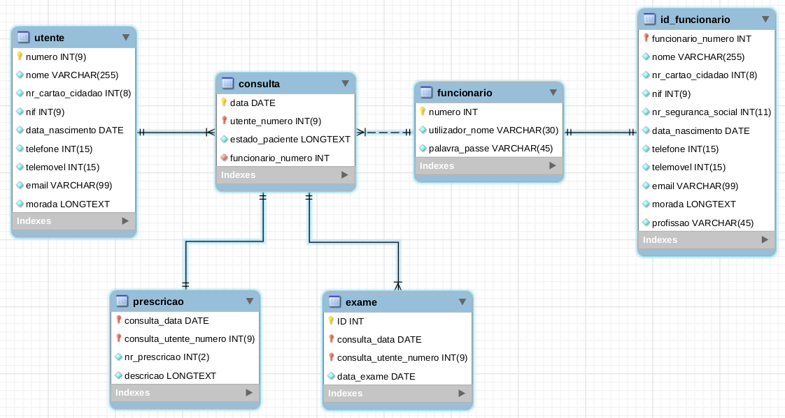

# NEW STUFF
clinica_v5.mwb is just like the folder clinica_v5, but the folder already has an Admin User. 
Login: admin
Password: admin

To use this folder, open Mysql-workbench, open the database you want to add this schema to.
After that, click Server (top left of the screen) -> Data Import.
Import from Dump Project Folder -> (choose the clinica_v5 folder)
Select the schema 'clinica'
Start import.

# Database

Section for detailing the database configuration

## Installation

- Open MySQLWorkbench

- In the toolbar located in the upper left corner
        - Click on "File"
        - Click on "Open Model..." 
        - Select the "clinica_v2.mwb file"

- Again on the toolbar, click on "database"
        - Click on "Forward Engineer..."
        - Proceed confirming each step
- Additional information
	- https://www.youtube.com/watch?v=4JhXRll-jkQ
## Usage

- Above the toolbar click on "Local instance 3306"

- Refresh the database schemas

## Possible errors

- In a windows environment the client and workbench versions may not match

- How to do a simple test:
	- Create a simple table with any column
	- Add the JSON type instead of INT or VARCHAR
	- Save the table
	- Try to access the table, your worbench may crash

- Alternative test:
	- In the final stage of importing the model
	- When the script appears, delete the word INVISIBLE from all lines
	- Resolves the first error
	- Then we receive information about incompatible versions

## Possible solutions

- The suggested downgrade may conflict with other services on Windows
- I will suggest a migration to Ubuntu
- When you want to access the database through windows
- Select bridged mode on the network interface
- Replace "localhost" with the "IP" of the virtual machine
- Update root password in MySQL:
	- sudo mysql -u root
	- ALTER USER 'root'@'localhost' IDENTIFIED WITH mysql_native_password BY '<troca_pela_pass_do_SQL>';

## Migration to ubuntu

- https://www.digitalocean.com/community/tutorials/how-to-install-mysql-on-ubuntu-20-04-pt
- https://linuxhint.com/installing_mysql_workbench_ubuntu/
- https://itectec.com/ubuntu/ubuntu-cannot-connect-mysql-workbench-to-mysql-server/
